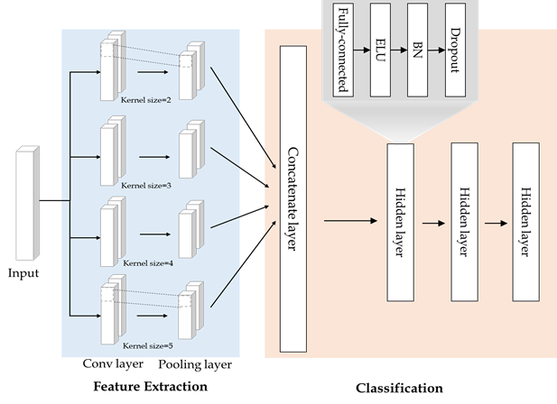
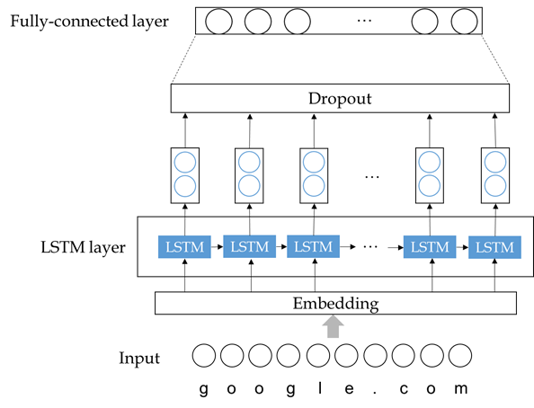
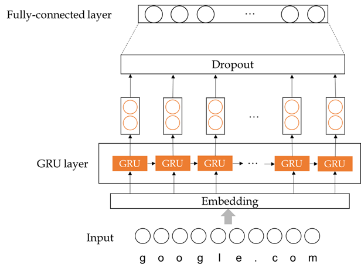
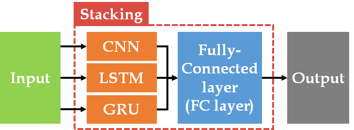

# 악성 URL 탐지 모델

악성 URL 탐지를 위해 앙상블 기법을 사용한 딥러닝 모델. 
기존에 존재하는 CNN, LSTM, GRU 모델을 스태킹 기법에 적용하여 모델 구현 

### CNN

- 1차원 시퀀스 데이터인 URL을 분류하기 위해 1DCNN을 사용
- `특성 추출 단계`: 성능 향상을 위해 다양한 커널 사이즈에서 특징을 추출하도록 커널 사이즈가 서로 다른 4개의 1D Convolution 연산을 사용
- `분류 단계`: 특성 추출 단계의 결과를 concatenation하고 hidden layer를 통해 분류 결과를 출력

### LSTM

- 시퀀스 데이터인 URL을 높은 성능으로 분류하기 위해 사용 
- LSTM Layer, Dropout, Fully-Connected Layer로 구성 
- LSTM Layer 출력 차원: 128, Dropout 비율: 0.5

### GRU

- GRU 모델은 LSTM보다 계산량을 줄인 모델 
- GRU Layer, Dropout, Fully-Connected Layer로 구성 
- GRU Layer 출력 차원: 128, Dropout 비율: 0.5

### 스태킹 모델

- 스태킹(Stacking): 여러 베이스 모델에서 예측하여 나온 결과 값을 스태킹 모델에 입력으로 하여 다시 모델을 학습시키는 기법 
- 베이스 모델: CNN, LSTM, GRU 모델 사용 
- 베이스 모델에서 예측한 결과 값을 입력으로 하여 Fully-Connected Layer로 구성된 스태킹 모델 학습

